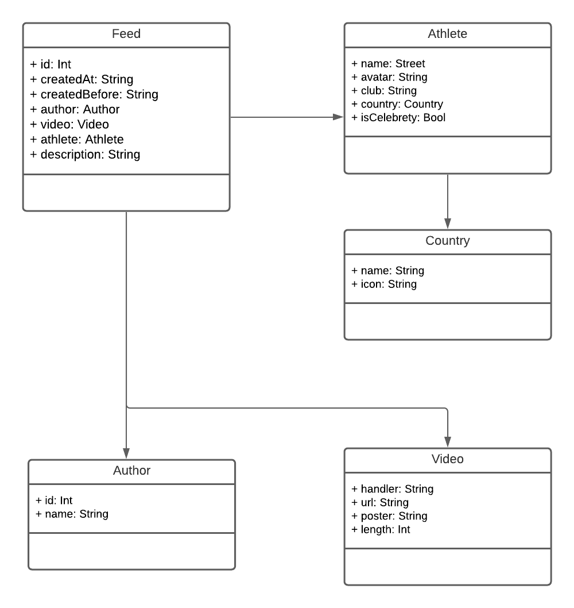
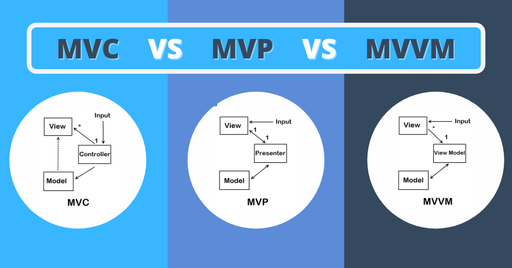
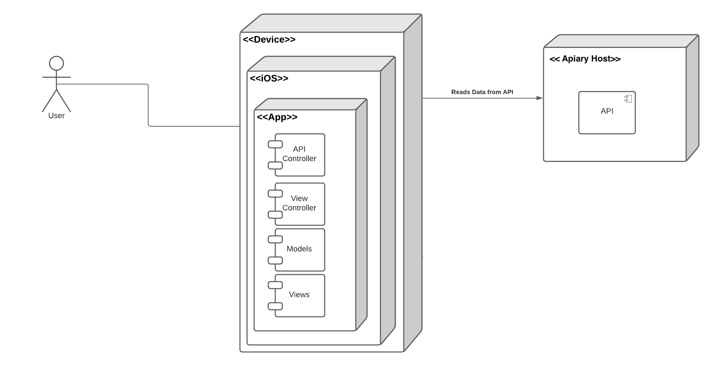

# JSON-Video-Feed

## Overview
[Description](#description)

[API](#api)

[Architecture](#architecture)

[Conclusion](#conclusion)

## Description
**This project is created as an interview task.**

Your task is to create an application that will serve a feed with posts that are based around
videos. An API specification will be provided as an Apiary document where you also have
mock servers (so you can ping them as an existing API). Also, some examples are
connected already so you can make dynamic calls for athletes and posts.
API is quite big, but you shouldn’t implement all routes. At least implement fetching and
displaying of the feed. After that, you can have as much fun as you want: make the video
play/pause in fullscreen, animate actions, add share, prepare for deep linking, make rating
fluid and animated, etc. These are not requirements, but are good places to showcase your
skill set.
Design is not provided, but that doesn’t mean you are required to demonstrate excellent
design skills. We don’t really care much about the design of technical task applications, as
long as you can demonstrate your knowledge and experience with the platform. On the other
hand, if you invest some time into design, it will not go unnoticed. 😁
You don’t have to spend a whole week on this task. In our opinion, you can showcase your
skill set within a couple of hours on working on your application. Everything else is your good
will of leaving a really good impression.

Requirements
There are no restrictions. You can use as many existing libraries as you find fit.
If you prefer, Swift, do it in Swift. If you like Objective C, do it in Objective C.
The point is to showcase your knowledge, but don’t go too deep: write all assumptions in
your code (for some specific cases, it is ok to go with the simple path and write that
assumption in a code block).

Good places to showcase your knowledge:
- Good setup documentation
- Dependency injection
- Tests
- Good scalability
- Clean VCS history
- Having VCS
- Robustness of input and output parameters
- CLEAN, layer architecture, MV***
- General simplicity
- Getting an invite for test application

## API
<a href="https://technicaltaskapi.docs.apiary.io/#introduction/accepted-headers/accept-language">Async API</a> is the API I received by Async. It generates many different properties and values for a video feed.

Below is a sample of the data that you can get from the API (For more please check the website).
```
[
  {
    "id": 19,
    "createdAt": "2019-08-22T12:22:22+00:00",
    "createdBefore": "1 year ago",
    "author": {
      "id": 12,
      "name": "RakiticFan4"
    },
    "sportGroup": {
      "id": 8,
      "name": "Other"
    },
    "video": {
      "handler": "aslkfjsad",
      "url": "https://test-videos.co.uk/vids/bigbuckbunny/mp4/h264/1080/Big_Buck_Bunny_1080_10s_5MB.mp4",
      "poster": "https://content.jwplatform.com/thumbs/JxwtpJDu-720.jpg",
      "type": "video/mp3",
      "length": 125
    },
    "description": "Winning goal against Russia securing Semi-finals in WorldCup Russia 2018.🇭🇷🇷🇺",
    "athlete": {
      "id": 21,
      "age": 27,
      "name": "Ivan Rakitić",
      "avatar": "https://drive.google.com/file/d/1ptgaw3aNkgot5PWP_AnlOJ_zNfxUkcto/view",
      "club": "FC Barcelona",
      "isCelebrity": true,
      "country": {
        "id": 8,
        "name": "Croatia",
        "slug": "croatia",
        "icon": "https://cdn.countryflags.com/thumbs/croatia/flag-round-250.png"
      },
      "sport": {
        "id": 2,
        "slug": "football",
        "name": "Football",
        "icon": "https://img.icons8.com/ios-filled/48/000000/football2.png"
      }
    },
    "bookmarked": false,
    "views": "Ivan Rakitić, Neymar Jr. + 46.8k others"
  },
  ]
```
## Work Process
### API Analyze and Model Define
How I started working?
Firstly, I analized the API. What kind of data it offers? How it works? and more.
Then, based on the requirements, I analized what kind of data I need for the feed. After realizing which data are needed and which ones are not, I realizied which model I have to create and then I visualized them using `UML Diagrams`. 



Thanks to the structure of the JSON API, I could easily achieve High Cohesion on my project. Which is really important for reducing module complexity and software maintainance. 

## Architecture



The architecture of the software is really important. Once you define requirements of the project, it's best to define architecture too. It allows you to manage and understand what it would take to make a particular change, and how the software will comunicate with the user and server or API provider.

Most common architectures for iOS are `MVC` and `MVVM`.<br>
For this simple task, MVC is enough.<br>

## Conclusion
At the end, I would like to present it visually how user will comunicate with the app and other services. To mention, I presented it on a `Deployment Diagram`.

